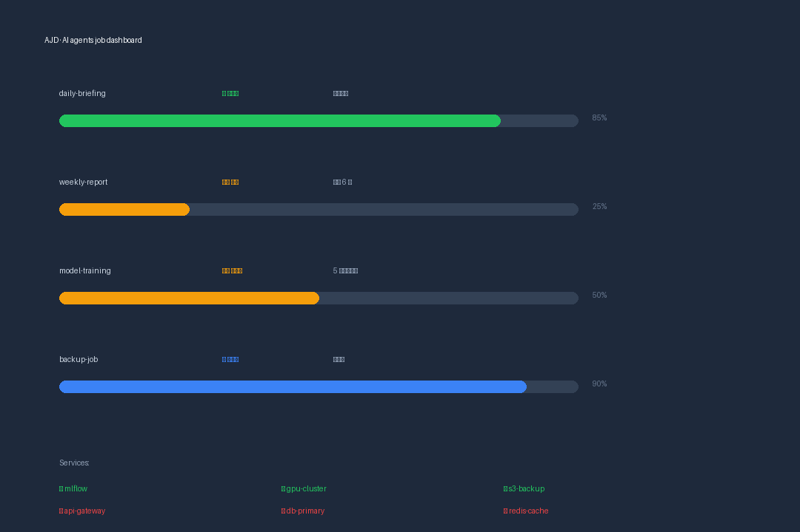
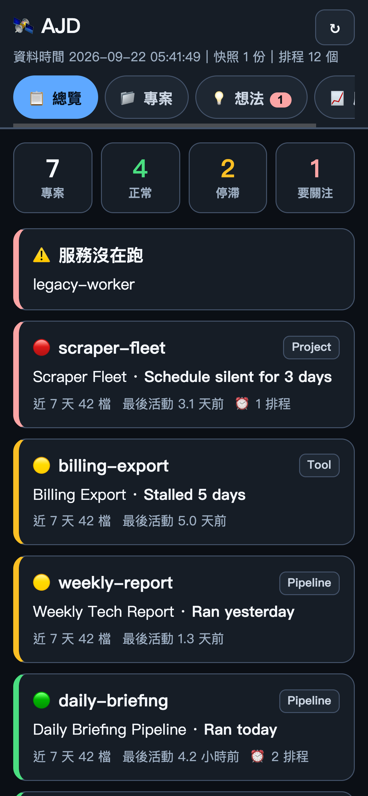

# AJD · AI agents job dashboard

[English](README.md) | **繁體中文**

[](LICENSE)
[](https://www.python.org/)
[](#系統需求)
[](https://github.com/hongchikuo-bot/ajd/issues)

> **你的 agent 掛在 cron 上跑。通常等到有人問「東西怎麼沒出來」，你才知道它壞了。**
>
> AJD 是一套自架、**唯讀**的任務監控台，給一整隊 AI agent 與排程工作用。它會**自己去發現**你的排程，
> 而不是要你先寫一份設定檔；而且它抓到大多數人漏掉的那種失敗：**跑了、但沒回報結果**。

<p align="center">
  
</p>

<p align="center">
  
</p>

---

## 為什麼還要多做一個監控台？

好用的監控台已經很多了。AJD 存在的理由是設計上的**一個差別**：**狀態是推導出來的，不是要你宣告的。**

| | **AJD** | uptime-kuma | homepage / glance |
|---|---|---|---|
| 狀態從哪來 | **自動推導**：檔案、cron、launchd/systemd timer、port、Docker | 每一項監控手動加 | 每個服務手寫 YAML |
| 抓得到「跑了但沒跑完」 | ✅ 心跳 + 漏回報偵測 | 只有 push 監控 | ✗ |
| 懂 agent 的結構（profile、bot、job、產出檔案） | ✅ | ✗ | ✗ |
| 停滯天數 / 最後活動 | ✅ 自動 | ✗ | 部分，要自己設門檻 |
| 加一個新專案 | 加一筆資料（或讓它自己發現） | 加監控 + 設定 | 寫 YAML |
| 掛掉不會拖垮產線 | ✅ **唯讀**，面板死掉不影響任何事 | ✅ | ✅ |

如果你已經很愛你的 YAML，那就繼續用。AJD 是給這種情況的：**「我的東西還在跑嗎？」的答案散在二十個地方，
而沒人想為自己的機器再維護一份設定檔。**

## 功能

- **自動探索（adapter 層）**：讀 `crontab`、`launchd` plist、`systemd` timer、agent 平台的 cron；
  每個來源都是獨立模組、輸出統一格式 —— 核心永遠不用學新方言。
- **心跳 API**：任何腳本跑完打一個 `POST /api/heartbeat`；AJD 會標出**跑了卻沒回報**的排程，
  這正是靠檔案時間猜測永遠抓不到的失敗。
- **停滯與活動追蹤**：最後活動時間、近 1/7/30 天產出檔案數、「停滯 N 天」，綠／黃／紅一眼看懂。
- **服務監控**：port 存活、HTTP 健康、Docker 容器。
- **每日快照與歷史**：跟昨天比對變了什麼，不必重新掃全世界。
- **想法收件匣**：隨手記下想法、掛研究、整理成一頁構想書，標記考慮中／已開案／擱置／放棄（連放棄原因都留著）。
- **手機優先 PWA**：可安裝到手機主畫面，深淺色跟著系統走。
- **唯讀設計**：面板絕不插在生產線上。

## 快速開始

**一行指令：**

```bash
curl -fsSL https://raw.githubusercontent.com/hongchikuo-bot/ajd/main/install.sh | bash
```

跑完打開 <http://127.0.0.1:5080/>。安裝成功會顯示 `✅ AJD 安裝完成！`

**讓你自己手上的 AI agent 幫你接線**：把 [`AGENTS.md`](AGENTS.md) 給它看。裡面說明怎麼用**你自己的機器**
填專案註冊表、怎麼呼叫部署路徑。這個一鍵安裝**會調用你自己的 agent** —— 這是刻意的，而且檔案裡有寫明。

**手動安裝**：[`SETUP.md`](SETUP.md)。

### 系統需求

macOS 或 Linux · Python 3.9+ · 其他都不是必需（Docker 只在走容器時需要）。
不用帳號、不上雲、不回傳任何遙測資料。

## 運作原理

```
        crontab ─┐
         launchd ─┤
         systemd ─┼──▶  adapter 層  ──▶  統一格式  ──▶  快照  ──▶  Flask + PWA
   agent cron ────┤    （每個來源         （專案、        （每日      （唯讀視圖）
   port / http ──┤      一個模組）         排程、心跳）      diff）
        docker ───┘
                                          ▲
                        POST /api/heartbeat ┘   ← 你的腳本回報「我做完了」
```

註冊表就是一個 JSON 檔（[`app/projects.example.json`](app/projects.example.json)），其他全部是自動探索或主動回報。
快照是 append-only 的 JSON，所以「歷史」不需要資料庫。

## 設定

```jsonc
{
  "projects": {
    "daily-briefing": {
      "name": "每日摘要產線",
      "type": "產線",
      "profile": "ops",                    // 你的 agent profile / 負責團隊
      "bot": "@ops_bot",                   // 操作它的那個 bot
      "desc": "抓取 → 合成 → 發布 → 通知",
      "services": ["api-gateway"],
      "depends_on": [],
      "entry": { "排程腳本": "/path/to/job.py", "產出": "/path/to/output/" },
      "links": [{ "label": "輸出頻道", "url": "https://example.com" }]
    }
  }
}
```

## 開發

```bash
pip install -r app/requirements.txt
cd app && python3 test_adapters.py        # adapter 測試
python3 app/app.py --port 5080            # 本機啟動
docker compose up -d                      # 容器路徑
```

CI（`install.sh` 與所有 Python 檔的語法檢查）放在 [`ci/github-actions.yml`](ci/github-actions.yml) ——
複製成 `.github/workflows/ci.yml` 就能在你的 fork 啟用。

## 文件

| 檔案 | 內容 |
|---|---|
| [`AGENTS.md`](AGENTS.md) | 把 AJD 接到**你自己的** AI agent（Hermes / Claude / Cursor） |
| [`SETUP.md`](SETUP.md) | 手動部署與排錯 |
| [`SCOPE.md`](SCOPE.md) | 專案範圍與路標 |
| [`QUESTIONS.md`](QUESTIONS.md) | 待決定的設計問題 |
| [`ci/README.md`](ci/README.md) | 如何啟用 CI workflow |

## 備註

- 介面為 **中英雙語**，預設跟隨瀏覽器語言，並提供語言切換按鈕。
- 截圖裡的專案名、路徑、服務全部是**虛構的示範資料**。

## 授權

MIT —— 見 [LICENSE](LICENSE)。© 2026 Kevin（[github.com/hongchikuo-bot](https://github.com/hongchikuo-bot)）
